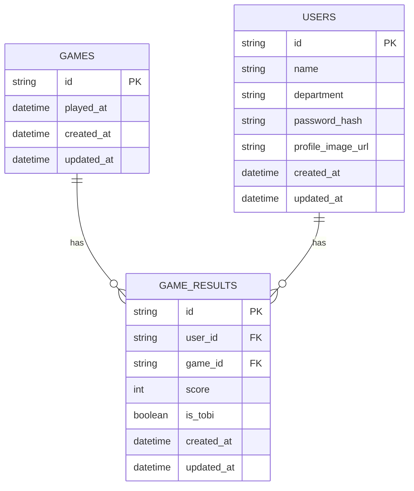

# １次要件定義

## プロジェクト概要

### 背景

- 自分たちが楽しむ、身内専用のアプリケーションがあっても面白いと思ったため
- ポートフォリオの一環として作成
- １次は麻雀の戦績管理アプリ

## 機能一覧

| 分類           | 機能名                     | 概要                                                                             |
| -------------- | -------------------------- | -------------------------------------------------------------------------------- |
| 認証           | ログイン                   | 認証のリクエストを行う                                                           |
|                | ログアウト                 | 認証削除のリクエストを行う                                                       |
| パフォーマンス | パフォーマンス表示         | 各パフォーマンス項目で最も優れた会員のデータを取得し、それを表示する             |
|                | パフォーマンス表示（個人） | 個人のパフォーマンス値を表示する                                                 |
| プレイスタイル | プレイスタイル表示         | 各プレイスタイルの合計の平均が最も優れている会員のデータを取得し、それを表示する |
|                | プレイスタイル表示（個人） | 個人のプレイスタイル値を表示する                                                 |
| ユーザー       | 入会機能                   | いわゆる会員登録                                                                 |
|                | 会員一覧機能               | 会員の一覧を表示する                                                             |
|                | 会員の詳細機能             | 会員の詳細情報を表示する                                                         |
| 対局           | 参加者選択機能             | 対局に参加する会員を選択する機能                                                 |
|                | 半荘登録機能               | 対局の結果を登録する機能                                                         |
|                | 対局未完了アラート機能     | 対局が未完了であることを通知する機能                                             |
|                | 途中結果表示機能           | 対局の途中結果を表示する機能                                                     |
|                | 直近の対局結果表示         | 直近の対局結果を表示する機能                                                     |
|                | 対局ロック機能             | 対局中は対局画面を開くことができない機能                                         |
|                |                            |                                                                                  |

## 機能仕様

### ログイン

- jwt or session
- ユーザー名とパスワードで認証
- 認証の期間は 1 ヶ月くらい？
- アプリを使用したら認証期間を更新する
  - それなら session の方がやりやすいかも

### ログアウト

- 認証情報を削除する

### パフォーマンス表示機能

- 平均ポイント・平均順位・ベストスコア・平均スコアの各項目で最も優れた成績を取得し、それを表示する
- 会員画像データ・名前・成績

### パフォーマンス表示機能（個人）

- 平均ポイント・平均順位・ベストスコア・平均スコアを表示する

### プレイスタイル表示機能

- ラス回避率・トップ率・連帯率の合計の平均が最も優れている成績を取得し、それを表示する

### 入会機能

- 名前・部署・パスワード・（トプ画）を登録する

### 会員一覧機能

- 会員の一覧を表示する機能
- 名前・トプ画

### 会員の詳細機能

- 会員の詳細を表示する機能
- 名前・部署名・トプ画

### 参加者選択機能

- 対局に参加する会員を選択する
- 4 名選択
- 認証と対局しているかどうか確認要

### 半荘登録機能

- 合計で 100,000 点になる
- 30,000 点返しの繰り上げ
- 着順ボーナス
  - 1 着:+20
  - 2 着:+10
  - 3 着:-10
  - 4 着:-20
- 飛びボーナス
  - +-10

### 対局未完了アラート機能

- 対局を記録してる会員が対象
- 対局が完了したら消える

### 途中結果表示機能

- 対局に参加している会員のみ対象
- 直近のプラスマイナスを表示

### 直近の対局結果表示

- 対局日・スコアを表示する機能

### 対局ロック機能

- 対局中で対局を記録してる以外の会員は対局登録をすることができない
- 対局が完了したら消える

# front のアーキテクチャ

## 各層の依存関係図

```mermaid
graph TD
  UI[UI層 (presentation)]
  Controller[Controller層 (hooks, UI logic)]
  Usecase[Usecase層 (ユースケース, ビジネスロジック, validation)]
  Core[Core層 (Entity, Model, ドメイン)]
  RepoInterface[Repository Interface (Usecase内で定義)]
  DetailRepo[Detail層 (Repository, インフラ実装)]

  UI --> Controller
  Controller --> Usecase
  Usecase --> RepoInterface
  RepoInterface <-- Repo
  Usecase --> Core
```

## 各層の説明

- **core/usecase**

  - アプリケーション固有のビジネスロジックやバリデーションを担当。
  - Repository のインターフェースを定義し、外部依存を排除。
  - 例: `core/usecase/login/login.ts`。

- **core/entity**

  - ドメインモデルやエンティティ、バリューオブジェクトなど純粋なビジネスルールを記述。
  - 例: `core/entity/users/model.ts`。

- **detail/controller**

  - UI 層と usecase 層の橋渡し。
  - hooks や UI ロジックを記述。
  - 例: `detail/login/controller/hooks/useLoginController.tsx`。

- **detail/repository**

  - usecase 層で定義された Repository インターフェースを実装。
  - API 通信や DB アクセスなどインフラ依存の処理を担当。
  - 例: `detail/login/repository/index.tsx`。

- **detail/UI**
  - 画面表示やユーザー入力の受け取りを担当。
  - UI コンポーネントやページを配置。
  - 例: `detail/login/UI/index.tsx`, `detail/login/UI/components/form.tsx`。

## ポイント

- 内側の層ほどビジネスロジックに集中し、外側の技術的な変更に影響されにくい設計です。
- 依存関係は必ず内側（Core）に向かい、外側（UI やインフラ）は内側の詳細を知らないようにします。
- これにより、UI やインフラの変更がビジネスロジックに波及しにくくなります。

##　目的

- 方針がサードパーティに依存しない設計を目指す
  - 近年の技術の移り変わりは激しい
- このアーキテクチャが１番生きる時は「UI/UX を変えずに使用するライブラリやフレームワークをリプレイス」。

## 素案

UI → controller(hooks) → usecase(機能ごとに validation,fetch と状態管理をまとめる) → repo_interface ← repo（useSWR とか）

# ER 図


